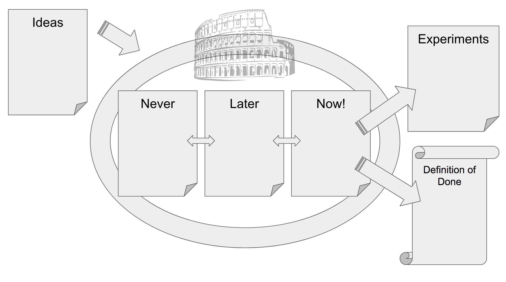

Hugo: OK. 

Jurgen: OK

Paula: OK for practice and first 2 guides (I see 3rd doesn’t meet our Guide definition of done :))

* * *

# Arena of Done

In incremental product delivery, you deliver a working, usable product every time you release it.

There is no hidden, remaining work that will surprise you later. This is called Done.

By releasing only Done increments, quality levels are clear and met.

This allows everybody to inspect value delivered and the real cost incurred.

This practice helps your team to improve your Definition of Done (DoD for short) to better fit your context.

Synonyms: 	--

Image:	[https://c2.staticflickr.com/8/7209/6880480969_6897714ab7_b.jpg](https://c2.staticflickr.com/8/7209/6880480969_6897714ab7_b.jpg)

Copyright:	"Arena" flickr photo by Tomislav Mavrovic https://flickr.com/photos/tomislavmavrovic/6880480969 shared under a Creative Commons (BY-ND) license

Tags:	definition of done, artifact transparency, done, releasable, team working agreements

Sources:

* [https://guntherverheyen.com/2017/06/15/what-are-you-defining-as-done/](https://guntherverheyen.com/2017/06/15/what-are-you-defining-as-done/)

* [https://guntherverheyen.com/2015/05/14/done-is-a-crucial-part-of-scrum-actually/](https://guntherverheyen.com/2015/05/14/done-is-a-crucial-part-of-scrum-actually/)

* [http://agilecomplexificationinverter.blogspot.nl/2011/09/exercise-definition-of-done.html](http://agilecomplexificationinverter.blogspot.nl/2011/09/exercise-definition-of-done.html)

* [https://www.agilealliance.org/glossary/incremental-development](https://www.agilealliance.org/glossary/incremental-development)

* [http://blog.crisp.se/2017/05/01/yassalsundman/constellation-retrospective](http://blog.crisp.se/2017/05/01/yassalsundman/constellation-retrospective)

* [http://www.gettingagile.com/2007/10/05/building-a-definition-of-done/](http://www.gettingagile.com/2007/10/05/building-a-definition-of-done/)

## Prepare the "Arena of Done" event

This guide helps you to prepare the "Arena of Done" event.

The Arena of Done is an interactive, collaborative event that helps your team and its stakeholders to improve your Definition of Done (DoD for short) to better fit your context.

You can run this event to create the first version of your DoD or to improve an existing DoD.

### Skim the guide "The Arena of Done"

Skim the guide "The Arena of Done" to get a general idea of the event.

The remaining steps in this guide help you to prepare the event.

### Collect materials

You’ll need:

* Six areas labeled "Ideas", “Never”, “Later”, “Now”, “Experiments” and “DoD”. You can use a flip chart sheet as an area, or draw the areas on a whiteboard.

* Stickies for all participants.

* Sharpies for all participants.

### Invite attendees

You will want to invite the team(s) that deliver the product.

Additionally, you can invite people ...  

* who can learn something in the event.

* who can benefit from the event.

* who can contribute to the event.

* with a passion for the product and its quality.

### Prepare opening scaling questions

You’ll open the event by asking several scaling questions.

When running this event multiple times, it is a good idea to vary the questions.

Questions that help set the stage are variations on the theme "we understand what has to be done to deliver a product increment to our customers."

For example:

* We can release our product to our users right after we finish our next feature.

* We have a clear shared understanding of what it takes to build and release our product.

* The quality level of our product is right where it should be.

### Prepare Ideas

To get the conversation started, collect some example DoD items.

For instance:

* Our product owner has accepted the product increment.

* The source code is maintainable.

* The product increment is tested.

* Documentation is up-to-date and published.

For more examples, see [David Koontz's Definition of Done exercise cards](https://docs.google.com/file/d/0B2tjUfS_gfL3MG9zaDlFWlNzOTg/edit).

## The Arena of Done

The Arena of Done is an interactive, collaborative event that helps your team and its stakeholders to improve your Definition of Done (DoD for short) to better fit your context.

You can run this event to create the first version of your DoD or to improve an existing DoD.

Consider preparing for this event by following the guide "Prepare the ‘Arena of Done’ event".

### Share the outline of the meeting.

In this meeting, you will collect ideas to improve your DoD. 

The best ideas will enter the Arena. 

If they survive the arena, they will reach the DoD. Or live another day as an experiment.

*Image: example arrangement of the areas*

### Start the session

Agree on a timebox. Two hours is an ample timebox when you do this for the first time.

If you have run the event before, consider a shorter timebox.

Establish that your DoD reflects your shared understanding of all that needs to be done to release a valuable product increment to your users.

### Set the stage

Ask the participants to show how much they agree with the following statements. A constellation exercise is a great way to do this.

* We can release our product to our users right after we finish our next feature.

* We have a clear shared understanding of what it takes to build and release our product.

* The quality level of our product is right where it should be.

### Collect ideas

You’ll start by collecting things you might do to improve our DoD.  An idea can be any modification to the DoD. Want to add an item? Modify an item already on the DoD? Is there an item on the DoD you always do but that does not provide value to anybody?

Set a timebox, 5 to 10 minutes works well. Ask participants to collect improvement ideas on the ideas board.

As a facilitator, you can bring in some of the examples you prepared. Bringing in examples can help to get the ideas flowing.

### Filter ideas

In this step, you will transfer ideas you want to discuss *now* to the discussion arena.

You will do this really quickly! Set a three-minute timebox. Ask team members to take turns.

If it is your turn: pick one item from the ideas board. Move it to one of the boards in the Arena. Allow no discussion at this stage. Just silently transfer items, one at a time.

It is OK for ideas to stay on the ideas board.

The items that remain on the ideas board might be good ideas, but nobody wants to discuss them now. Good ideas will emerge again.

### Discuss items

Set a timebox, 15 minutes works well. Items that are on the "Now" board at the end of this step will get a chance to survive the Arena.

Team members take turns. When it is your turn:

* Pick a single item from any board in the arena.

* Move the item one board to the left or right. In this step, an item is not allowed to leave the arena.

* Give a short motivation for your action.

* You may also pass if you see no reason to move an item.

This step ends when the timebox expires, or when all participants pass in a row.

### Optional: take a break

If the event will take over an hour, consider taking a 5 to 10-minute break now.

### Optional: do an additional discussion round

Do a Roman vote with the participants whether they would like to have another discussion round.

80% thumbs up? Do another discussion round.

### Act on items on the "Now" board

Set a timebox, 10 minutes works well. Which items are most important? Dot vote on the items on the Now board.

For each item, by importance: 

* Roman vote: should we add this item to the DoD directly?

* 80% yes: move to the DoD

* Less than 80%: move to the experiments board

It is OK if some items remain on the "Now" board, as long as the important ones move on.

### Reflect on experiments

The board of experiments visualizes things you think should be added to the DoD now, but, for some reason, can’t add to our DoD. 

This can be, because your team does not know how to do it yet, or you are uncertain of what the impact will be.

Consider dot voting on the items on experiments board to identify the most important ones.

Ask teams and their Product Owners to set aside time to address the important experiments.

Ask teams to take ownership of the most important items, for instance by adding items to their backlog and sharing progress on the work.

### Optional: Clean up the experiments board

Want to clean up the experiments board? Start with the **least** important item. Do a Roman vote on the statement "Let’s **NOT** do this item!". 80% or more agrees? Shred the sticky.

Ask participants if someone would like to take ownership of one the remaining items.

### Close the event

Do an exercise with all participants to close the event.

Quickly reflect on what has been achieved this meeting.

Do you have an increased shared understanding of what it means to deliver a Done product increment?

Consider running the ["return on time invested"](https://app.mindsettlers.com/guide/65mRXjJHSoSe6AU0I6AOSM) exercise.

### Clean up

Take pictures of all the boards. Optionally share the pictures with the participants. Throw away any items on the Ideas, "Never", “Later” and “Now” boards. Don’t worry, the important stuff will emerge again.

